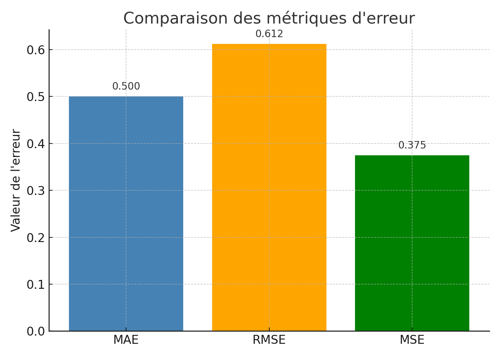
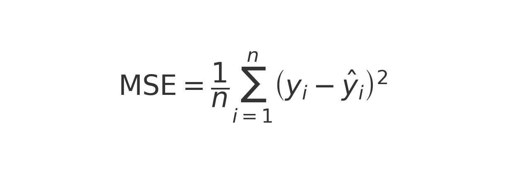
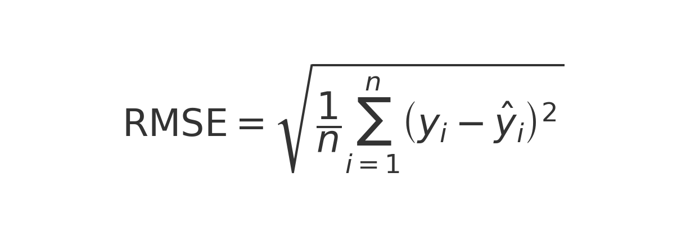
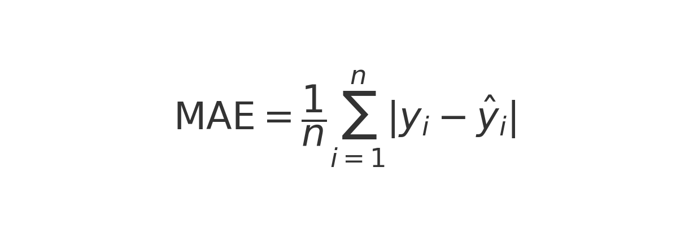
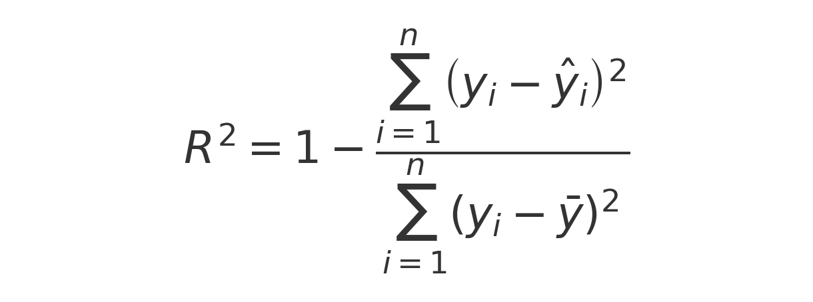
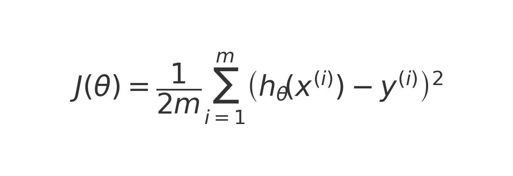
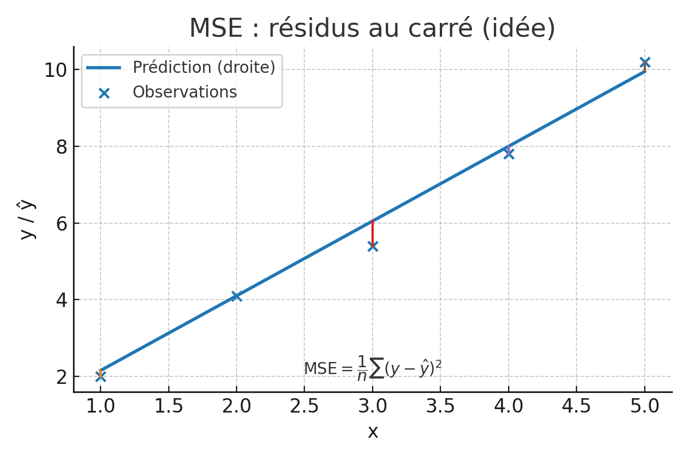
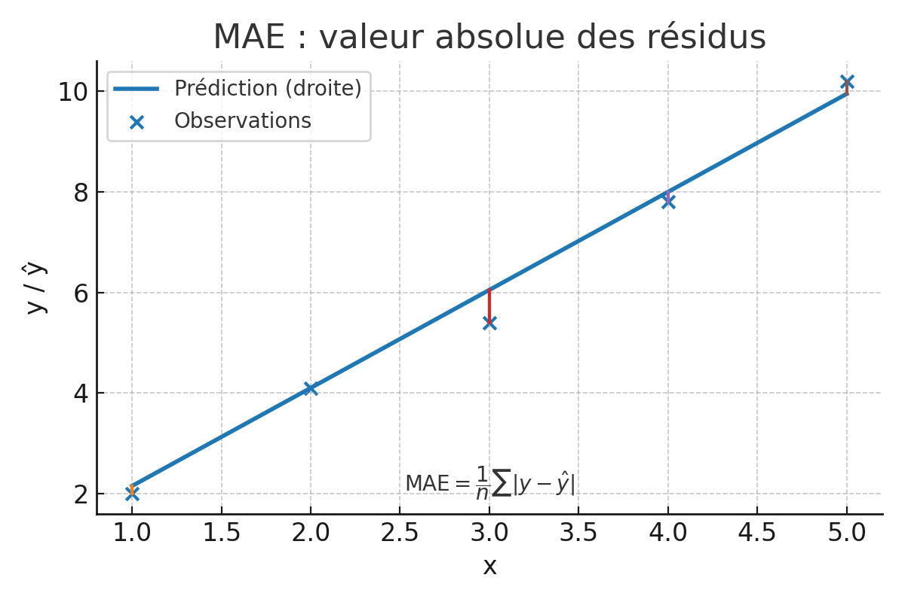

# Évaluation mathématique des modèles de régression

Ce document présente les principales métriques d’évaluation en régression, ainsi que la fonction de coût utilisée en apprentissage supervisé.

---

## 1. Erreur quadratique moyenne (MSE)

### Définition
\[
MSE = \frac{1}{n} \sum_{i=1}^{n} (y_i - \hat{y}_i)^2
\]

- Mesure l’erreur moyenne au carré entre les prédictions \(\hat{y}_i\) et les valeurs réelles \(y_i\).  
- Sensible aux valeurs aberrantes.  
- Exprimée dans l’unité au carré de la variable cible.  

### Exemple en Python
```python
from sklearn.metrics import mean_squared_error

mse = mean_squared_error(y_true, y_pred)
```

---

## 2. Fonction de coût en régression linéaire

### Définition
\[
J(\theta) = \frac{1}{2m} \sum_{i=1}^{m} (h_\theta(x^{(i)}) - y^{(i)})^2
\]

- Identique au MSE avec un facteur \(\tfrac{1}{2}\).  
- Ce facteur est introduit uniquement pour **simplifier la dérivée** lors de la descente de gradient.  

### Exemple en Python
```python
m = len(y_true)
J = (1/(2*m)) * np.sum((y_pred - y_true)**2)
```

### Résultat comparatif
- \( MSE = 0.375 \)  
- \( J(\theta) = 0.1875 \)  
- \( 2 \times J(\theta) = 0.375 = MSE \)  

---

## 3. Visualisation de la fonction de coût

La fonction de coût est convexe et possède un minimum unique.  

.png)  

Le minimum est atteint pour la valeur optimale du paramètre \(\theta\).  

---

## 4. Racine de l’erreur quadratique moyenne (RMSE)

### Définition
\[
RMSE = \sqrt{MSE}
\]

- Exprimé dans la même unité que la variable cible.  
- Interprétation plus intuitive que le MSE.  
- Toujours sensible aux grandes erreurs.  

---

## 5. Erreur absolue moyenne (MAE)

### Définition
\[
MAE = \frac{1}{n} \sum_{i=1}^{n} |y_i - \hat{y}_i|
\]

- Moyenne des écarts absolus.  
- Plus robuste aux valeurs aberrantes que MSE/RMSE.  

### Exemple en Python
```python
from sklearn.metrics import mean_absolute_error

mae = mean_absolute_error(y_true, y_pred)
```

### Résultat
\[
MAE = 0.5
\]

---

## 6. Comparaison graphique des métriques

  

### Interprétation
- **MAE** : mesure simple et robuste, moins influencée par les grandes erreurs.  
- **RMSE** : plus grand que le MAE car il pénalise davantage les grandes erreurs.  
- **MSE** : exprimé au carré, utile comme fonction objectif mais moins intuitif.  

---

## 7. Points clés à retenir

- **MSE / RMSE** : privilégier si l’on veut pénaliser fortement les grandes erreurs.  
- **MAE** : préférable en présence de valeurs aberrantes.  
- **Fonction de coût J(θ)** : identique au MSE à un facteur \(\tfrac{1}{2}\) près, introduit pour simplifier les calculs.  


---

# Annexes visuelles

## Formules principales
- MSE  


- RMSE  


- MAE  


- R²  


- Fonction de coût J(θ)  


## Graphiques pédagogiques
- Exemple MSE (segments = résidus, la somme des carrés correspond au MSE)  


- Exemple MAE (segments = |résidus|, la somme des valeurs absolues correspond au MAE)  


- Fonction de coût (parabole convexe avec minimum en θ optimal)  
.png)

- Comparaison des métriques (MAE, RMSE, MSE)  

